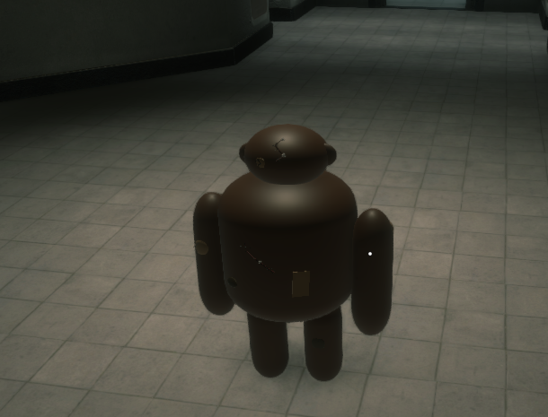
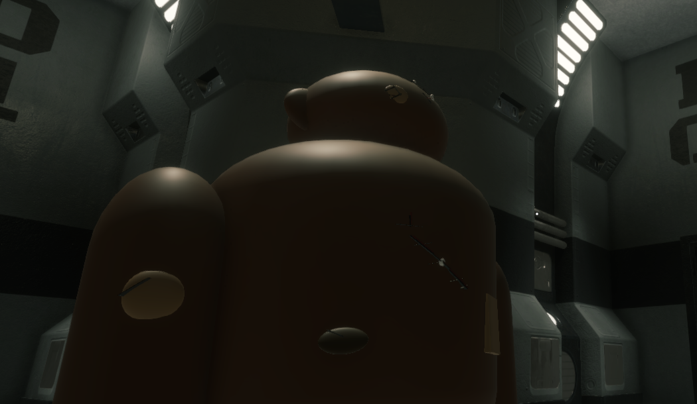
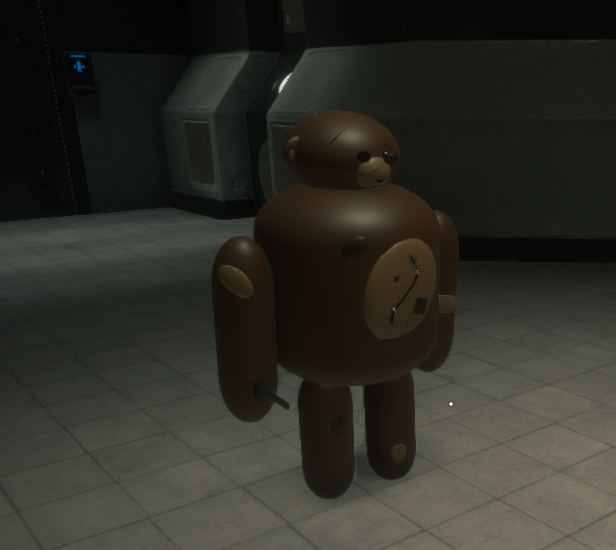

# SCP-1048 (Builder Bear)

**Commercial SCP: Secret Laboratory Custom Role Showcase**

A premium SCP:SL gameplay expansion introducing a fully playable SCP-1048 entity with custom animations, audio systems, multiplayer synchronization, unique abilities, and a dedicated custom schematic.

Developed as a commercial project for multiplayer SCP: Secret Laboratory servers.

---

## Project Showcase

  

---

## Video Demonstration

[Watch Gameplay Showcase](https://youtu.be/Df6faoootxg)

---

## Screenshots

### Screenshot1

### Screenshot2

### Screenshot3

---

## Project Overview

SCP-1048 transforms the standard SCP:SL experience by introducing a completely custom playable character built around a dedicated schematic, custom gameplay mechanics, synchronized animations, and immersive audio feedback.

The goal was to create a role that feels visually distinct while remaining fully integrated into multiplayer gameplay.

### Key Features

- Custom SCP-1048 role
- Dedicated custom schematic/model
- Fully animated character
- Dash ability with collision detection
- Wave emote system
- Spatial audio integration
- Custom attack handling
- Configurable balancing options
- RemoteAdmin integration
- Multiplayer synchronization

---

## Author

### Adam Jastrzębski

